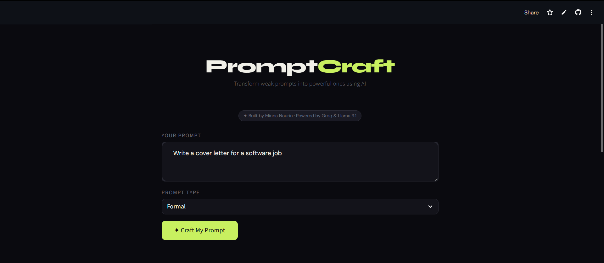
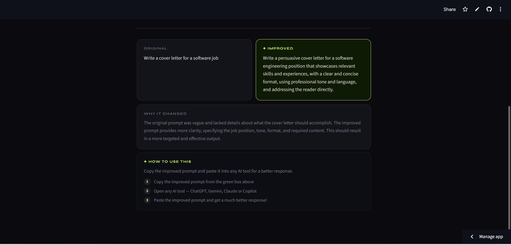

# PromptCraft AI ✦

> Transform weak prompts into powerful ones instantly using AI


---
## 🖥️ Screenshot




## 🌐 Live Demo
👉 **[Try it here](https://promptcraft-ai-kgwbjnn4t8iuq2oztfvi6m.streamlit.app)**

---
# ✦ PromptCraft AI

## 🚀 AI That Turns Weak Prompts Into Powerful Results

PromptCraft AI is an AI-powered prompt optimization tool that transforms vague or unclear user inputs into structured, high-quality prompts that produce better responses from large language models.

It is built using Python, Streamlit, and the Groq API with the Llama 3.1 model.

---

## 🎯 Problem

Large language models are highly sensitive to input quality.

Poorly written prompts often lead to:
- Generic responses  
- Misinterpreted intent  
- Inconsistent outputs  
- Reduced usefulness of AI tools  

---

## 💡 Solution

PromptCraft AI acts as a **prompt intelligence layer** that refines user input before sending it to the model.

It transforms:

> “write about AI”

into:

> “Write a structured, beginner-friendly explanation of Artificial Intelligence covering definitions, applications, and key challenges.”

---

## ⚡ Key Features

- Converts weak prompts into optimized prompts  
- Improves clarity, structure, and intent  
- Supports multiple prompt types:
  - General  
  - Creative  
  - Technical  
  - Academic  
  - Formal  
  - Marketing  
- Explains improvements made to prompts  

---

## 🧠 How It Works

User Input → Intent Analysis → Prompt Restructuring → LLM Optimization → Improved Prompt Outpu

---

## 🛠️ Tech Stack
| Technology | Purpose |
|---|---|
| Python | Core language |
| Streamlit | Web app framework |
| Groq API | AI inference engine |
| Llama 3.1 | Language model |

---

## 🚀 How to Run Locally

**Step 1 — Clone the repository**
```bash
git clone https://github.com/MinnaNourin/PromptCraft-AI.git
cd PromptCraft-AI
```

**Step 2 — Install dependencies**
```bash
pip install -r requirements.txt
```

**Step 3 — Get your free Groq API key**
```
Go to → https://console.groq.com/keys
Sign up free → Create API Key → Copy it
```

**Step 4 — Create secrets file**
```
Create .streamlit/secrets.toml and add:
GROQ_API_KEY = "your_groq_key_here"
```

**Step 5 — Run the app**
```bash
streamlit run app.py
```

---

## 📁 Project Structure
```
PromptCraft-AI/
├── .streamlit/
│   └── secrets.toml    ← API key (not pushed)
├── .gitignore
├── app.py              ← Main application
├── requirements.txt    ← Dependencies
└── README.md           ← You are here
```

---

## 💡 How to Use
```
1. Enter your rough prompt
2. Select the prompt type
3. Click ✦ Craft My Prompt
4. Copy the improved prompt
5. Paste into ChatGPT, Gemini or Claude
6. Get a much better response!
```

---

## 🏅 Certification
This project was built as a practical application 
of the IBM SkillsBuild certification:

**Craft Precise Prompts for AI Models**
- Issued by: IBM SkillsBuild
- Issued on: 05 April 2026
- Verify: https://www.credly.com/go/fL6rkCD3

---

## 👩‍💻 Built by
**Minna Nourin**
IBM SkillsBuild Certified — Prompt Engineering

---

## 📄 License
This project is open source and available 
under the MIT License.
